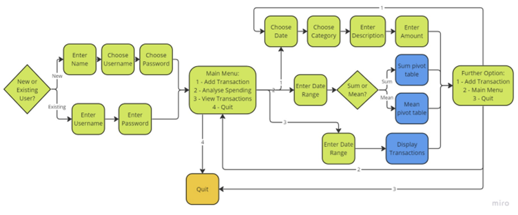
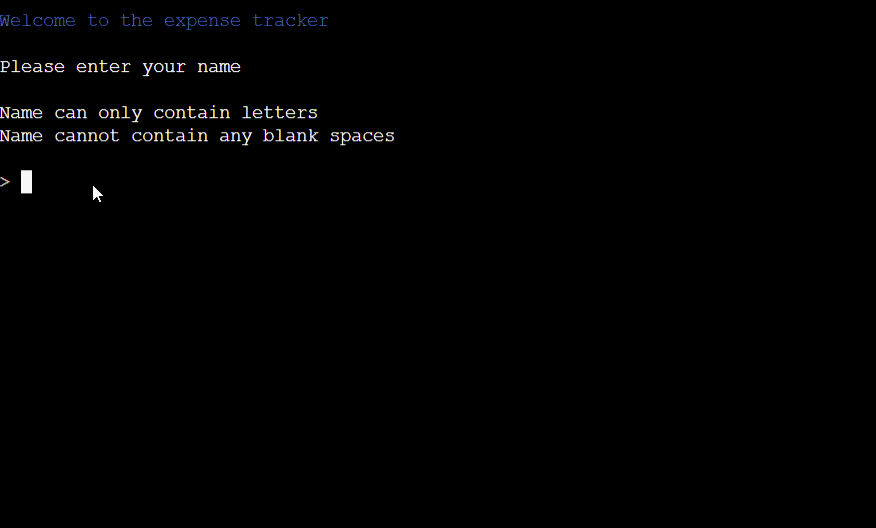
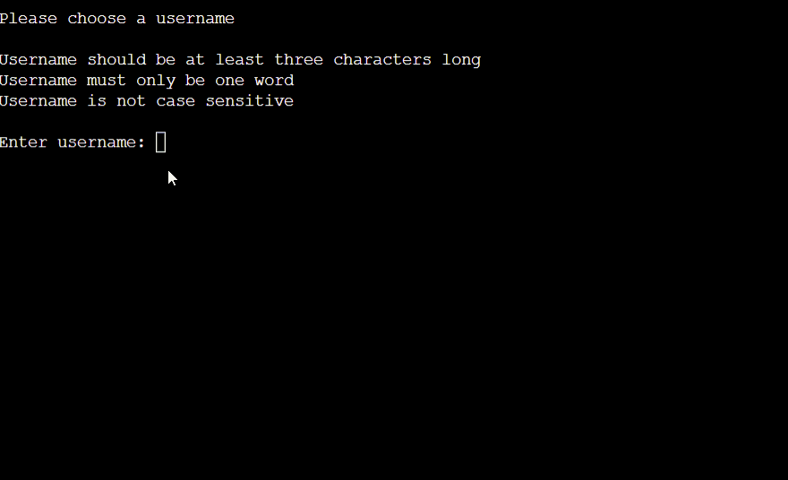
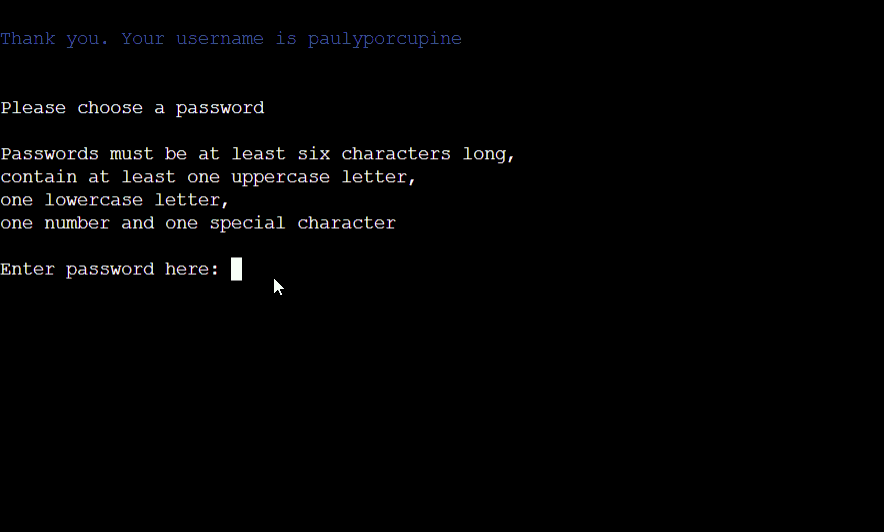
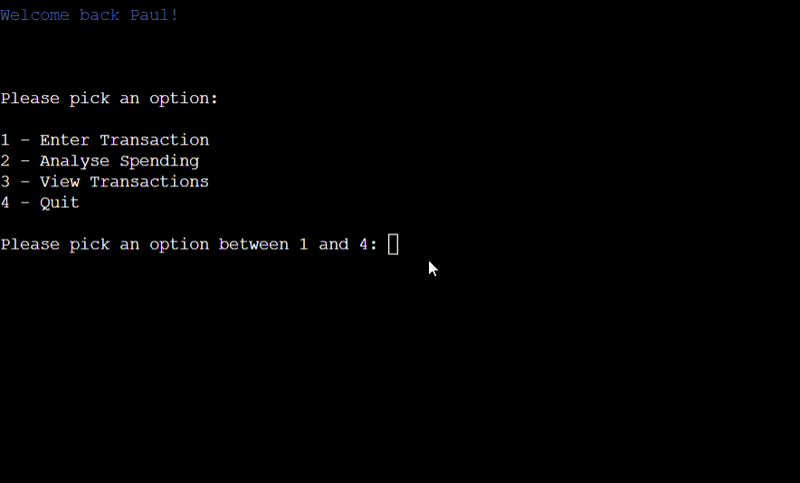
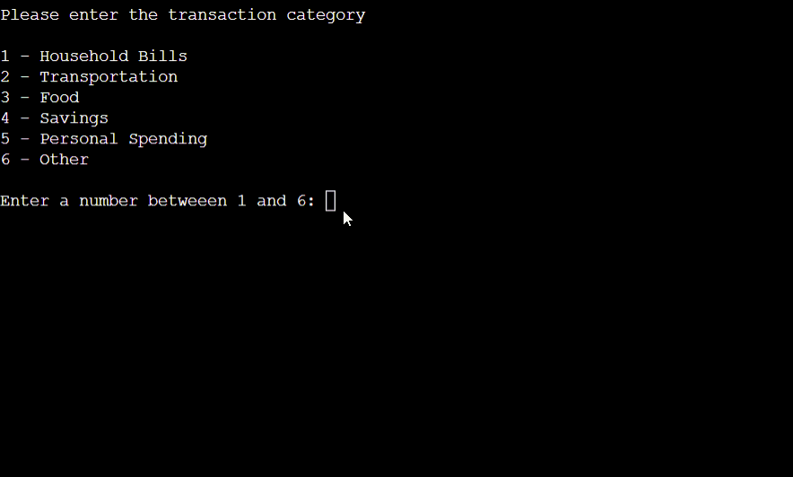
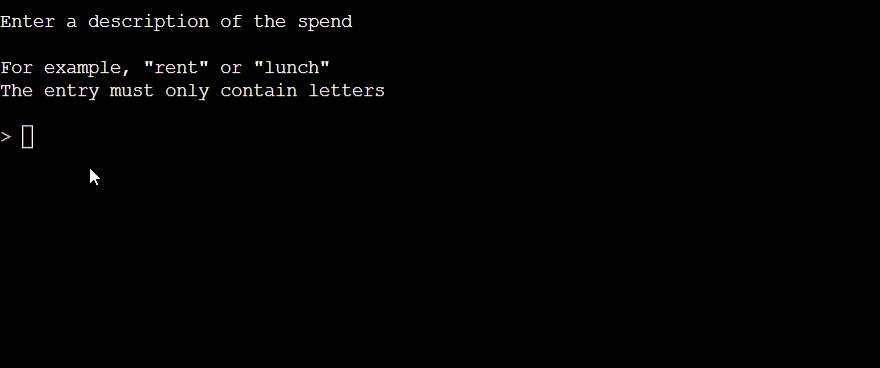

# Expense Tracker

The expense tracker is a useful tool for the user to track, view and analyse their spending.

# Contents

- [Expense Tracker](#expense-tracker)
- [Contents](#contents)
- [User Experience (UX)](#user-experience-ux)
  - [Initial Discussion](#initial-discussion)
    - [Key Information for the Site](#key-information-for-the-site)
  - [User Stories](#user-stories)
    - [Client Goals](#client-goals)
    - [Visitor Goals](#visitor-goals)
- [Design](#design)
  - [Colour Scheme](#colour-scheme)
  - [Flowcharts](#flowcharts)
- [Features](#features)
  - [Existing Features](#existing-features)
    - [Landing Page](#landing-page)
    - [New User](#new-user)
    - [Existing User](#existing-user)
    - [Main Menu](#main-menu)
    - [Enter Transaction](#enter-transaction)
    - [Next Choice](#next-choice)
    - [Analyse Spending](#analyse-transaction)
    - [View Transactions](#view-transactions)
  - [Future Implementations](#future-implementations)
- [Technologies Used](#technologies-used)
  - [Languages Used](#languages-used)
  - [Frameworks, libraries and programs used](#frameworks-libraries-and-programs-used)
- [Deployment](#deployment)
- [Testing](#testing)
  - [PEP8 Vlaidator](#pep8-validator)
  - [Testing User Stories](#testing-user-stories)
    - [Client Goals](#client-goals-1)
    - [Visitor Goals](#visitor-goals-1)
  - [Full Testing](#full-testing)
    - [Landing Page](#landing-page-2)
    - [New User](#new-user-2)
    - [Existing User](#existing-user-2)
    - [Main Menu](#main-menu-2)
    - [Enter Transaction](#enter-transaction-2)
    - [Next Choice](#next-choice-2)
    - [Analyse Spending](#analyse-transaction-2)
    - [View Transactions](#view-transactions-2)
  - [Bugs](#bugs)
    - [Resolved Bugs](#resolved-bugs)
    - [Unresolved Bugs](#unresolved-bugs)
- [Credits](#credits)
  - [Code Used](#code-used)
  - [Content](#content)
  - [Media](#media)
  - [Other](#other)
  - [Acknowledgements](#acknowledgements)

[Back to top](#expense-tracker)

# User Experience (UX)

## Initial Discussion

The expense tracker is a tool for the user to keep track of their spending. 
The program is designed to be simple and intuitive, allowing the user to add transactions, analyse their spending and view their transactions

### Key Information for the Site

- New user to set up a new account
- Exisiting user to access their account
- Functions to;
    - Add transactions
    - Analyse spending
    - View transactions

## User Stories

### Client Goals

- A simple program that users will want to use
- An program that meets the user’s needs
- The user to feel their security is taken seriously

### Visitor Goals

#### New User Goals

- To be able to set up a new account
- To understand how to use the program
- To be able to choose their own username

#### Existing User Goals

- For personal data to be stored securely
- To access an exisiting account
- To be able to add transactions, by category and with a description
- To be able to view the sum and mean values of their transactions, by category, for a selected date range
- An option to view their transactions for a selected date range
- A pleasant user experience

[Back to top](#expense-tracker)

# Design

## Colour Scheme

I used the colorama library to style the font by colour. I chose to only change the font colour as I believe this makes the program look cleaner and more professional.
I chose the following colours for different commands:
    
- Red: to display error messages

- Blue: welcoming messages for the user

- Green: for valid inputs

- Yellow: to display pandas dataframes

- Magenta: to display the message when the transaction is being added and the user selects to quit 

## Flowcharts

- The flowcharts were created using Miro

### User Experience

### Python Validation

# Features

## Existing Features

### The Landing Page

- The landing page is the page the user lands on when the program is first run
- There is a logo that explains, to the user, what the program does
- The user must input either N or E to choose if they are a new or existing user
- The user is able to input N or E in either upper or lowercase format
- If any other entry is made, the user will see an error message displayed and be asked to enter the information again:

### New User

- If N or n is selected the page will clear and the user will see a welcome message. 
- They are asked to enter their name and the format this should be in is shown. The name can be the same as an existing user as this has no impact on the program.
- The user will see an error message if they input a name that is anything but letters or contains blanks spaces

- When a valid name is entered the screen will clear and the user will be asked to add a username and advised of the format.
- I made the decision to not make the username case sensitive as Google Sheets will only allow uniquely named worksheets to be created and this doesn’t take into account the case for the letter. If the username was case sensitive there is the risk two users will choose the same username with different cases, i.e. Bob and bob and the second user would not be able to have a worksheet created
- The validation checks that the username is more than three characters long and is only one word and whether the username already exists
- I considered having an upper limit for length of the username but, upon research, decided against this as it can limit the user's choice

- When the user has chosen a valid username, the screen will clear, they are thanked and told their username and they will be asked to choose a password
- The validation checks the password:
    - Is six or more characters in length
    - Contains at least one upper and lower case letter
    - Contains at least one number
    - Contains at least one special character
- This password will be visible when typed. I chose to keep this as visible, rather than the letters be replaced with another character, so the user was able to see the password they had typed
- When the user chooses a valid password they will be shown a message to tell them that password is valid

- The screen clears and the user sees a ‘Hi {name} message and will see the [main menu](#main-menu)

### Existing User

- The user will be asked to enter their username. If they enter a username that does not exist they will see an error message

- If they enter a username that exists they will be asked to enter their password
- The password will be displayed as asterisks to improve security
- The user will then be asked to confirm their password
- If the passwords do not match, or the password doesn’t match the stored username, the user will see an error message
- When the username and passwords are inputted correctly, the screen will clear and the user will get a welcome back message. This will be the name they inputted when they ran the program as a new user and the user will see the [main menu](#main-menu)

### Main Menu

- The main menu gives the user four options;
    - Enter transaction
    - Analyse spending
    - View Transactions
    - Quit
- The user must pick a number, between 1 and 4, to choose an option

### Enter Transaction

- Firstly the user will be asked to enter the date of the transaction
- The date must:
    - Be in the format DD/MM/YYYY
    - Not be in the future
    - Be a valid date

- The screen will then clear and ask the user to enter a transaction category, from the following options;
    - 1 - Household Bills
    - 2 – Transportation
    - 3 – Food
    - 4 – Savings
    - 5 – Personal Spending
    - 6 – Other
- These categories were chosen as the main categories cover the main area that the majority of people spend in and the other section covers anything that doesn’t fit into these categories
- The option is validated to check the input is a number between 1 and 6

- When a valid option is chosen, the screen will clear and the user is asked to enter a description of the spend. This can only contain letters
- I considered putting a validation on the length of characters but, decided against this, as some users may not want to write a description 

- When a valid description is entered, the screen will clear, and the user will be asked to enter the spend amount 
- This is validated to check an amount that is either an integer, or to two decimal places is entered and that the amount is greater than zero
- The user will get a message to say their transaction is being added and then a thank you message, using their name, to say that the transaction has been added
- I considered putting a delay, between the adding transaction and the thank you message. I decided against this as, with this type of program, I believe speed would be more important to the user, especially if they are adding multiple transactions

- The users transaction will be appended, as a row, to the bottom of their named Google worksheet, the screen will clear and then user will be asked for their [next choice](#next-choice)

### Next Choice

- The user is asked what they would like to do next from the following options;
    - 1 – Enter another transaction
    - 2 – Return to the main menu
    - 3 – Quit
- If the user selects 1 the screen will clear and they will be taken to the [enter date](#enter-date) part of the getting transaction function
- If the user selects 2 they will be taken back to the [main menu](#main-menu)
- If the user selects 3 they will receive a thank you and goodbye message

### Analyse Spending

- If the user selects 2 from the [main menu](#main-menu) the screen will clear and they will be asked to enter a start date and end date. Each of these dates is validated the same way as the date for entering a [transaction](#enter-transaction)
- The date range will be validated to ensure that the end date is within 90 days of the start date and that the end date isn’t before the start date

- If the dates entered are valid, the screen will clear and the user will be asked if they would like to see the sum or mean of their spending 
- The option is validated to make sure the user only inputs 1 or 2
- The dates the user has chosen will be displayed and the pivot table will be displayed for whichever of the options they have chosen 
- The user will be asked what they would like to do [next](#next-choice)

### View Transactions

- Option 3 from the [main menu](#main-menu) is the option for the user to view their transactions
- They will asked to choose a date range in the same way as they would for [analyse spending](#analyse-spending-gif)
- A pivot table of their spending will be displayed

- The user will be asked what they would like to do [next](#next-choice)

## Future Implementations

- An option to create a budget and tell the user how much budget they have remaining
- Allow the user to display transactions by spend category
- Suggest a username, that is not already in use, to the user
- If the user selects they are an existing user, and their username is not found, give an option to select new user
- Add a forgotten password function – possibly with password hints
- The ability for the user to delete transactions
- For the user to be able to confirm the transaction before it’s posted
- Allowing the user to enter a name that has characters used in different languages

[Back to top](#expense-tracker)

# Technologies Used

## Languages Used

This program was written using Python.

## Frameworks, libraries and programs used

- Codeanywhere – To write the code
- Github - To save and store files
- Heroku - To deploy and run the live project
- Mimo - to produce the flowcharts
- PEP8 - to validate the Python code, improving the readability and consistency

The Python libraries used are:

- gspread - an API for Google Sheets
- google.oauth2.service_account - allows the program to access data held in Google Sheets
- regex - checks for patterns in a string 
- datetime - allows dates and times to be manipulated
- colorama - to display the text in different colours
- pwinput - to display the inputed passwords as asterisks
- os - to clear the page on the live program
- time - used to stipulate time between letters showing and to use the sleep function to delay the page clearing 
- sys - used in the function to slowly print text to the screen
- bcrypt - to store the password, in Google Sheets, encrypted
- pandas - to produce the dataframes 
- numpy - used to produce the pivot table displaying the sum of values

[Back to top](#expense-tracker)

# Deployment and Local Development

## Deployment

This site is deployed using Heroku and following these steps:

1. Create a [Heroku](https://id.heroku.com/login) account or, if you already have one, sign in
2. Click the 'new' button and select 'create new app'
3. Enter a unique name for your app and choose the region you are in
4. Click 'create app'
5. Click 'settings' and scroll down to 'Config Vars'. Click 'reveal Config Vars'
6. In the box with the text 'KEY' type PORT and 8000 in the box with the text 'VALUE'
7. Scroll to the next section, buildpacks and click 'add buildpack'. Add Python and NodeJS, in that order. Click 'Add Buildpack'
8. Scroll back to the top of the page and click 'Deploy'
9. Scroll to the Deployment method and choose Github
10. In the next section, Connect to Github, type in your repository name. If you press the search button it'll bring up all your repositories. Connect to the correct repository
11. Scroll down to the two sections for deployment (automatic deploys or manual deploys). The automatic deplays will update each time the 'git push' command is entered. For the maunal deploy, this will deploy the branch specified, in it's current state, when the 'Deploy Branch' button is clicked 

[Back to top](#expense-tracker)

 

