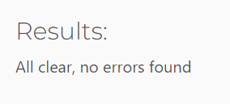
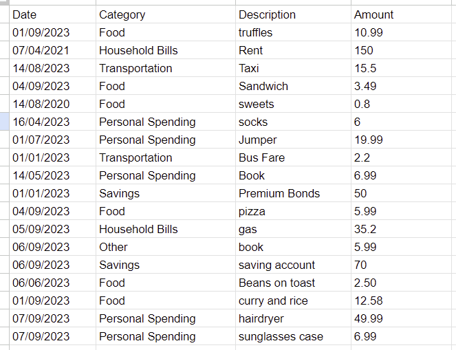
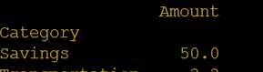

# Testing

## Contents

- [Testing](#testing)
  - [PEP8 Validator](#pep8-validator)
  - [Testing User Stories](#testing-user-stories)
    - [Client Goals](#client-goals)
    - [First Time Visitor Goals](#first-time-visitor-goals)
    - [Returning Visitor Goals](#returning-visitor-goals)
  - [Full Testing](#full-testing)
    - [Landing Page](#landing-page)
    - [New User](#new-user)
    - [Existing User](#existing-user)
    - [Main Menu](#main-menu)
    - [Enter Transaction](#enter-transaction)
    - [Next Choice](#next-choice)
    - [Analyse Spending](#analyse-spending)
    - [View Transactions](#view-transactions)
  - [Future Testing](#future-testing)
  - [Bugs](#bugs)
    - [Resolved Bugs](#resolved-bugs)
    - [Unresolved Bugs](#unresolved-bugs)

## PEP8 Validator

I ran my code throught the [Code Institute Python Linter](https://pep8ci.herokuapp.com/). This showed no errors:

[Back to top](#testing)

## Manual Testing

### Testing User Stories

### Client Goals

**Goal**|**How is this Achieved?**
:-----:|:-----:
A simple program that users will want to use|The program is intuitive and guides the user through each step of using it. It is a simple program and the colours used, for the fonts, provide interest to the user
An program that meets the user’s needs|The program allows the user to input transactions, to be able to analyse their spending and to view their transactions
The user to feel their security is taken seriously|When an existing user enters their password the text is shown as asterisks so it is hidden from anyone that could be watching. The passwords are stored, in Google Sheets, as encrypted to prevent hacking. The error message, for the username and password not matching, doesn't say whether it's the username or password that has been entered wrong. This is another level of security to stop another user working out these details from which is wrong

### First Time Visitor Goals

**Goal**|**How is this Achieved?**
:-----:|:-----:
To be able to set up a new account|The user selects N or n, from the page at the beginning of the programe, and then follows the steps to create their account
To understand how to use the program|The program guides the user, though every step of the way, and is simple and intuative to use
To be able to choose their own username|The user is able to choose their own username as long as it's not already in use by another user

### Returning Visitor Goals

**Goal**|**How is this Achieved?**
:-----:|:-----:
For personal data to be stored securely|Bcrypt has been used so that users passwords are encrypted before they're stored in Google Sheets
To access an exisiting account|The first menu asks the user if they are a new or existing user. The user enters E or e to access an existing account
To be able to add transactions, by category and with a description|These are all asked for when the user choses to add a tranasaction
To be able to view the sum and mean values of their transactions, by category, for a selected date range|The user is able to do both these things by selecting option 2 from the main menu
An option to view their transactions for a selected date range|The user is able to view their transactions from a selected 90 day period
A pleasant user experience|This is a simple and visually plesant program to use

[Back to top](#testing)

## Full Testing

### Landing Page

**Test**|**Expected Outcome**|**Test Keyed**|**As Expected?**|**Pass?**
:-----:|:-----:|:-----:|:-----:|:-----:
The letter N|Asks user to choose a username|N|Yes|Yes
The letter n|Asks user to choose a username|n|Yes|Yes
The letter E|Asks user to enter their password|E|Yes|Yes
The letter e|Asks user to enter their password|e|Yes|Yes
Any other letter|Tells the user they didn't enter the correct value and asks them to choose either N or E|Z|Yes|Yes
Any other number|Tells the user they didn't enter the correct value and asks them to choose either N or E|1|Yes|Yes
Any special character|Tells the user they didn't enter the correct value and asks them to choose either N or E|!|Yes|Yes

### New User

#### Choose Name

**Test**|**Expected Outcome**|**Test Keyed**|**As Expected?**|**Pass?**
:-----:|:-----:|:-----:|:-----:|:-----:
Any string containing only letters|Takes the user to a new page to choose a username|Percy|Yes|Yes
A blank space|Tells the user the name can only contain letters and asks them to try again|" "|Yes|Yes
A string containing numbers|Tells the user the name can only contain letters and asks them to try again|percy123|Yes|Yes
A string containing special characters|Tells the user the name can only contain letters and asks them to try again|percy!|Yes|Yes
A string with a space|Tells the user the name cannot contain balnk spaces and to try again|percy pig|Yes|Yes

#### Choose Username

**Test**|**Expected Outcome**|**Test Keyed**|**As Expected?**|**Pass?**
:-----:|:-----:|:-----:|:-----:|:-----:
Username >= 3 characters and not currently used|Ask user to choose a password|percy123|Yes|Yes
Username >= 3 characters and currently used|Tells the user that username already exists and to choose another option|gail|Yes|Yes
Username < 3 characters|Tells the user the username must contain at least three characters and to choose another option|pe|Yes|Yes

#### Choose Password

**Test**|**Expected Outcome**|**Test Keyed**|**As Expected?**|**Pass?**
:-----:|:-----:|:-----:|:-----:|:-----:
A string with at least 1 uppercase letter, 1 lowercase leter, 1 number and 1 special character|Tells user the password is valid and asks the user what they would like to do, adds the new username and password to the Google sheets worksheet named 'users'|P4ssword!5|Yes|Yes
A string less than 6 characters long|Tells the user the user the password was 4 characters long and that it must be at least six characters long|Pass|Yes|Yes
A string with no lowercase letters|Tells the user the username must contain at least one lowercase letter and to try again|P4SSWORD!5|Yes|Yes
A string with no uppercase letters|Tells the user the username must contain at least one uppercase letter and to try again|p4ssword!5|Yes|Yes
A string with no numbers|Tells the user the username must contain at least one number and to try again|Password!|Yes|Yes
A string with no special characters|Tells the user the username must contain at least one special character and to try again|P4ssword5|Yes|Yes

### Existing User

#### Enter Username

**Test**|**Expected Outcome**|**Test Keyed**|**As Expected?**|**Pass?**
:-----:|:-----:|:-----:|:-----:|:-----:
A username that exists|Asks user to enter their password|gail|Yes|Yes
A username that doesn't currently exist|Error message - Username does not exist. Please try again|ellie|Yes|Yes

#### Enter Password

**Test**|**Expected Outcome**|**Test Keyed**|**As Expected?**|**Pass?**
:-----:|:-----:|:-----:|:-----:|:-----:
Enter a password the first time|Asks the user to confirm their password|Passw0rd!|Yes|Yes
Enters a second password, that matches the first password and is the password stored|Screen to clear. Message Welcome back {name} to show and the main menu|Passw0rd!|Yes|Yes
Enters a second password, that matches the first password but isn't the password stored|Error message - Your username and password do not match. Please try again|Passw1rd! for both|Yes|Yes
Enters a second password that doesn't match the first password|Error message - Passwords do not match. Please try again|Passw0rd! entered for first password and Passw1rd! for the second password|Yes|Yes

### Main Menu

**Test**|**Expected Outcome**|**Test Keyed**|**As Expected?**|**Pass?**
:-----:|:-----:|:-----:|:-----:|:-----:
Choose option 1|Screen to clear. User asked to enter the date of the transaction|1|Yes|Yes
Choose option 2|Screen to clear. User asked to enter the start date of date range|2|Yes|Yes
Choose option 3|Screen to clear. User asked to enter the start date of date range|3|Yes|Yes
Choose option 4|Message - Thank you for using this tracker. Goodbye {name}|4|Yes|Yes
A blank space|Error message - You did not enter a number! Please try again|" "|Yes|Yes
A number not between 1 and 4|Error message - That isn't a valid option. Please try again|5|Yes|Yes
A negative number between -1 and -4|Error message - That isn't a valid option. Please try again|-2|Yes|Yes
A letter|Error message - That isn't a valid option. Please try again|z|Yes|Yes
A special character|Error message - That isn't a valid option. Please try again|$|Yes|Yes

### Enter Transaction

#### Enter Date

**Test**|**Expected Outcome**|**Test Keyed**|**As Expected?**|**Pass?**
:-----:|:-----:|:-----:|:-----:|:-----:
A valid date in the format DD/MM/YYYY|Screen to clear. User to be taken to the transaction category menu|01/09/2023|Yes|Yes
A date before 01/01/2000|Error message - Date cannot be before 01/01/2000. Please enter a valid date|01/12/1999|Yes|Yes
A future date in the format DD/MM/YYYY|Error message - Date cannot be in the future. Please enter a valid date|31/12/2024|Yes|Yes
Any date in the format DD/MM|Error message - Date is not in the correct format. The date should be in the format DD/MM/YYYY. Please enter a valid date|01/09|Yes|Yes
Any date in the format DDMMYYYY|Error message - Date is not in the correct format. The date should be in the format DD/MM/YYYY. Please enter a valid date|01092023|Yes|Yes
Any date that doesn't exist|Error message - Please enter a valid date|31/09/2023|Yes|Yes
Enter any other characters|Error message - Date is not in the correct format. The date should be in the format DD/MM/YYYY. Please enter a valid date|a date|Yes|Yes

#### Transaction Category

**Test**|**Expected Outcome**|**Test Keyed**|**As Expected?**|**Pass?**
:-----:|:-----:|:-----:|:-----:|:-----:
Choose option 1|Screen to clear. User asked to enter a desription of the spend|1|Yes|Yes
Choose option 2|Screen to clear. User asked to enter a desription of the spend|2|Yes|Yes
Choose option 3|Screen to clear. User asked to enter a desription of the spend|3|Yes|Yes
Choose option 4|Screen to clear. User asked to enter a desription of the spend|4|Yes|Yes
Choose option 5|Screen to clear. User asked to enter a desription of the spend|5|Yes|Yes
Choose option 6|Screen to clear. User asked to enter a desription of the spend|6|Yes|Yes
A blank space|Error message - Incorrect option chosen. Please enter a number between 1 and 6|" "|Yes|Yes
A number not between 1 and 4|Error message - Incorrect option chosen. Please enter a number between 1 and 6|5|Yes|Yes
A negative number between -1 and -4|Error message - Incorrect option chosen. Please enter a number between 1 and 6|-2|Yes|Yes
A letter|Error message - Incorrect option chosen. Please enter a number between 1 and 6|z|Yes|Yes
A special character|Error message - Incorrect option chosen. Please enter a number between 1 and 6|$|Yes|Yes

#### Spend Description

**Test**|**Expected Outcome**|**Test Keyed**|**As Expected?**|**Pass?**
:-----:|:-----:|:-----:|:-----:|:-----:
A string containing only letters|Screen to clear. User asked to enter the amount spent|lunch|Yes|Yes
A string containing only letters with a blank space|Screen to clear. User asked to enter the amount spent|fish and chips|Yes|Yes
A string containing numbers and letters|Error message - The description must only contain letters. Please try again|lunch123|Yes|Yes
A string containing only numbers|Error message - The description must only contain letters. Please try again|123456|Yes|Yes
A blank space|Error message - Description is required. Please try again|" "|Yes|Yes

#### Enter Amount

**Test**|**Expected Outcome**|**Test Keyed**|**As Expected?**|**Pass?**
:-----:|:-----:|:-----:|:-----:|:-----:
A positive float to two decimal places|Message - adding transaction. Thanks the user and tells them their transaction has been added. Screen to clear and user asked what they would like to do next|55.55|Yes|Yes
A positive integer to two decimal places|Message - adding transaction. Thanks the user and tells them their transaction has been added. Screen to clear and user asked what they would like to do next|36|Yes|Yes
A positive integer to more than two decimal places|Error message - That is not a valid amount. Please try again|10.123|Yes|Yes
A positive integer to one decimal place|Error message - That is not a valid amount. Please try again|6.1|Yes|Yes
Zero|Error message - The amount must be greater than £0. Please try again|0|Yes|Yes
A negative float to two decimal places|Error message - The amount must be greater than £0. Please try again|-5.12|Yes|Yes
A negative integer to two decimal places|Error message - The amount must be greater than £0. Please try again|-100.25|Yes|Yes
A negative integer to more than two decimal places|Error message - That is not a valid amount. Please try again|-15.987|Yes|Yes
A negative integer to one decimal place|Error message - That is not a valid amount. Please try again|-10.2|Yes|Yes
A blank space|Error message - That is not a valid amount. Please try again|" "|Yes|Yes

### Next Choice

**Test**|**Expected Outcome**|**Test Keyed**|**As Expected?**|**Pass?**
:-----:|:-----:|:-----:|:-----:|:-----:
Choose option 1|Screen to clear. User asked to enter the date of the transaction|1|Yes|Yes
Choose option 2|Screen to clear. User to be shown the main menu|2|Yes|Yes
Choose option 3|Message - Thank you for using this tracker. Goodbye {name}|3|Yes|Yes
A blank space|Error message - You did not enter a correct value. Please enter a number between 1 and 3|" "|Yes|Yes
A number not between 1 and 4|Error message - You did not enter a correct value. Please enter a number between 1 and 3|5|Yes|Yes
A negative number between -1 and -4|Error message - You did not enter a correct value. Please enter a number between 1 and 3|-2|Yes|Yes
A letter|Error message - You did not enter a correct value. Please enter a number between 1 and 3|z|Yes|Yes
A special character|Error message - You did not enter a correct value. Please enter a number between 1 and 3|$|Yes|Yes

### Analyse Spending

#### Enter Date Range

**Test**|**Expected Outcome**|**Test Keyed**|**As Expected?**|**Pass?**
:-----:|:-----:|:-----:|:-----:|:-----:
A valid start date in the format DD/MM/YYYY|User asked to enter end date|01/09/2023|Yes|Yes
A valid end date in the format DD/MM/YYYY|Screen to clear. User asked if they would like to see the sum or average of their spending|05/09/2023|Yes|Yes
A start or end date before 01/01/2000|Error message - Date cannot be before 01/01/2000. Please enter a valid date|01/12/1999|Yes|Yes
A start or end date that is a future date in the format DD/MM/YYYY|Error message - Date cannot be in the future. Please enter a valid date|31/12/2024|Yes|Yes
Any start or end date in the format DD/MM|Error message - Date is not in the correct format. The date should be in the format DD/MM/YYYY. Please enter a valid date|01/09|Yes|Yes
Any start or end date in the format DDMMYYYY|Error message - Date is not in the correct format. The date should be in the format DD/MM/YYYY. Please enter a valid date|01092023|Yes|Yes
Any start or end date that doesn't exist|Error message - Please enter a valid date|31/09/2023|Yes|Yes
Enter any other characters|Error message - Date is not in the correct format. The date should be in the format DD/MM/YYYY. Please enter a valid date|a date|Yes|Yes
A start and end date that are more than 90 days apart|Error message - Dates cannot be more than 90 days apart. Please enter new dates|01/01/2023 and 01/09/2023|Yes|Yes
An end date that is before the start date|Error message - End date cannot be before the start date. Please enter new dates|01/09/2023 and 31/08/2023|Yes|Yes

#### Sum or Mean Option

**Test**|**Expected Outcome**|**Test Keyed**|**As Expected?**|**Pass?**
:-----:|:-----:|:-----:|:-----:|:-----:
Choose option 1|Screen to clear. User shown the dates chosen and a pivot table with the sum of the transactions, by category, for that date range. User asked what they would like to do next|1|Yes|Yes
Choose option 2|Screen to clear. User shown the dates chosen and a pivot table with the mean of the transactions, by category, for that date range. User asked what they would like to do next|2|Yes|Yes
A blank space|Error message - not a valid option. Please enter 1 or 2|" "|Yes|Yes
A number not between 1 and 2|Error message - not a valid option. Please enter 1 or 2|5|Yes|Yes
A negative number between -1 and -2|Error message - not a valid option. Please enter 1 or 2|-2|Yes|Yes
A letter|Error message - not a valid option. Please enter 1 or 2|z|Yes|Yes
A special character|Error message - not a valid option. Please enter 1 or 2|$|Yes|Yes

### View Transactions

**Test**|**Expected Outcome**|**Test Keyed**|**As Expected?**|**Pass?**
:-----:|:-----:|:-----:|:-----:|:-----:
A valid start date in the format DD/MM/YYYY|User asked to enter end date|01/09/2023|Yes|Yes
A valid end date in the format DD/MM/YYYY|Screen to clear. User shown the dates chosen and their transactions from that date range. User asked what they would like to do next|05/09/2023|Yes|Yes
A start or end date before 01/01/2000|Error message - Date cannot be before 01/01/2000. Please enter a valid date|01/12/1999|Yes|Yes
A start or end date that is a future date in the format DD/MM/YYYY|Error message - Date cannot be in the future. Please enter a valid date|31/12/2024|Yes|Yes
Any start or end date in the format DD/MM|Error message - Date is not in the correct format. The date should be in the format DD/MM/YYYY. Please enter a valid date|01/09|Yes|Yes
Any start or end date in the format DDMMYYYY|Error message - Date is not in the correct format. The date should be in the format DD/MM/YYYY. Please enter a valid date|01092023|Yes|Yes
Any start or end date that doesn't exist|Error message - Please enter a valid date|31/09/2023|Yes|Yes
Enter any other characters|Error message - Date is not in the correct format. The date should be in the format DD/MM/YYYY. Please enter a valid date|a date|Yes|Yes
A start and end date that are more than 90 days apart|Error message - Dates cannot be more than 90 days apart. Please enter new dates|01/01/2023 and 01/09/2023|Yes|Yes
An end date that is before the start date|Error message - End date cannot be before the start date. Please enter new dates|01/09/2023 and 31/08/2023|Yes|Yes

[Back to top](#testing)

## Future Testing

For anyone wishing to test this program, as an existing user, I have left some data saved in Google Sheets

Percy's username is percypig and his password is Passw0rd!

## Bugs

### Resolved Bugs

**Bug**|**Resolution**
:-----:|:-----:
Date entered could be in the future|Added code to get today’s date and check whether this values was greater than the date entered
Was getting a keyError when an existing user was entering their password|Moved the username\_password\_dic to the part of the function just before the if statement relating to this, rather than at the beginning of the function
Error that line length was too long for the code to add the data to the Google sheet|"This was because it was indented several times. Added a separate function
The enter transaction function was asking the user to pick an option between 1 and 6 rather than asking if they would like to perform another option|There was only a break for one of if statements in the while loop. Added breaks for all if statements in the function
The second loop of entering a transaction resulted in enter Y / N without asking the user if they would like to perform another action|Moved the get\_transaction function from the main function to the choose\_options function
The user was able to enter a negative transaction amount|Add a check, to the validate\_amount function, to check that the amount entered is greater than 0
User was being asked for the date, after picking the option to quit, from the main menu functions|Removed transaction functions from the main function
The previous method I had to validate the transaction amount was to two decimal places (if len(float\_number.rsplit('.')[-1]) != 2) was not working for intergers the had two numbers but was for integers of a different length. I decided that it would be a better user experience if all integers could be entered|Used a regex expression to validate
Was able to create a username that was all lower case to one that exited (ie, Barry and barry but, Google Sheets considers these the same name and so could not create a new sheet|"Added .lower() to the username input to stop this being case sensitive
After fixing the previous bug, the f statements showing the users username were displaying in lowercase|Removed .lower() from the input and created a new variable named username.lower. This is the variable used to record the name, and create a new workbook, in google sheets
The username input was allowing more than one word to be chosen for the username|I considered allowing this to stay in place but, following research around the best practise for usernames, I decided it would be better for this to only contain one word, for simplicity. I added an if statement to check for “ “ in the username validation
The user was able to enter the date in the format D/M/YYYY rather than the format asked (DD/MM/YYYY)|Added a check that split the date at the / character and then checked the length of each part
The user entering an integer or DD/MM wasn’t returning a error|Added a check to make sure the date inputted is 10 characters long
Out of bounds nanosecond timestamp error due to a date entered before 21/09/1677|I added a check to make sure the date entered was this century
The user entering more than one word in the transaction description was generating an error|Changed the validation, from checking isalpha() to using a regex pattern that looks for only words and spaces
When validating a date range the error statement was in an infinite loop. This is because there was a nested while loop where the start\_date and end\_date were being validated, in their own loops and the validate date range was the final nested loop. The get\_date\_range loop was going back to the validate date\_range each time there was a valueerror and this was causing an infinite loop|I separated the getting the start and end date into their own function. 
When a blank input was given in the main menu option, the error message was appearing but the program terminated|The blank entry validation wasn’t in the try statement. It was added to the try statement

### Unresolved Bugs

- When the pivot table is returned, from the analyse spending function, the headers on the tables displayed aren't inline (the amount header shows slightly higher). A future implementation could be to improve the visual showing of the pivot table

- The user can still type whilst the command messages are printing which causes an error message in the next input. This would be another consideration for a future implementation

[Back to top](#testing)
